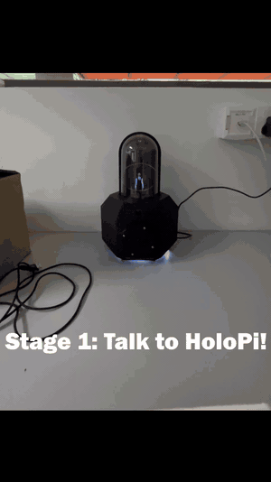

# Holographic Pipeline (HoloPi)


HoloPi is a distributed edge--cloud system for an interactive holographic retail assistant. A Raspberry Pi publishes camera and microphone media to a Windows backend through MediaMTX. Backend services perform active-speaker detection, speech recognition, retrieval, response generation, speech synthesis, lip synchronization, and gesture recognition. A React scene renders the avatar and product interface, while `main_orchestrator.py` coordinates service state and interaction flow.

This repository contains the implementation and experimental workspaces. It does **not** contain the LaTeX manuscript as another runnable module. The link between manuscript claims and code is recorded in [`docs/reproducibility/`](docs/reproducibility/README.md).

## Demonstration

<p align="center">
  <a href="https://raw.githubusercontent.com/NightTalkerMY/FinalYearProject/main/assets/demo.mp4">
    
  </a>
</p>

<p align="center">
  The preview is muted and shown at 2x speed. <a href="https://raw.githubusercontent.com/NightTalkerMY/FinalYearProject/main/assets/demo.mp4">Watch the full 56-second demonstration with audio.</a>
</p>

## Repository Scope

The repository uses three reproducibility statuses:

- **Live-integrated:** called by the retained end-to-end runtime.
- **Benchmark-only:** evaluated in an experiment workspace but not called by the live runtime.
- **Configuration-dependent:** source is retained, but execution requires external assets, hardware, or deployment configuration.

| Component | Location | Runtime status | Purpose |
|---|---|---|---|
| Central orchestration | `main_orchestrator.py` | Live-integrated, configuration-dependent | Starts and coordinates backend services and scene state |
| Media relay | `mediamtx/` | Live-integrated, external binary required | WHIP/WHEP transport for the `cam1` and `avatar` streams |
| Raspberry Pi capture | `raspi/camera/` | Live-integrated, Pi hardware required | Publishes 960 x 540 video at 30 fps and 48-kHz mono audio |
| DART gesture gating | `Gesture_System/real-time-HGR-application/` | Live-integrated, classifier asset required | Segments and classifies intentional gestures |
| CATT-ASD | `online_ASD/realtime/pipeline_main.py` | Live-integrated | Gates speech processing using causal active-speaker detection |
| Speech-to-text | `STT/` | Live-integrated | Faster-Whisper transcription |
| Live retrieval | `RAG/` | Live-integrated | Dense and BM25 retrieval followed by ordinary cross-encoder reranking |
| Phi-2 service | `Chatbot_Phi2/` | Configuration-dependent | Generates the retail response using a local PEFT adapter |
| Speech and visemes | `TTS/ZipVoice/`, `TTS/allosaurus/` | Configuration-dependent | Generates speech and lip-sync cues |
| Avatar scene | `react_avatar/` | Live-integrated, 3D assets required | Renders and republishes the holographic scene |
| LARA evaluation | `experiment_metric/reranker_metric/eval.ipynb` | Benchmark-only | Evaluates length-aware packing and reciprocal rank anchoring |
| DART evaluation workspace | `Gesture_System/real-time-HGR-application/metric_code/` | Experiment workspace | Contains evaluation code and a recovered legacy single-session report |

### Important LARA Boundary

The live `RAG/DatabaseRouting.py` service performs dense top-50 and BM25 top-50 retrieval, deduplication, ordinary cross-encoder batching, and score sorting. Although its constructor retains a `use_length_sorting` option, the option is not used by the live query path, and reciprocal rank anchoring is not applied. The complete evaluated LARA procedure is therefore **benchmark-only**, not live-integrated.

## System Flow

1. The Raspberry Pi publishes the `cam1` audio/video stream to MediaMTX by WHIP.
2. DART and CATT-ASD consume `cam1` by WHEP on the backend.
3. CATT-ASD gates transcription and forwards accepted text to the orchestrator.
4. The orchestrator calls RAG, Phi-2, ZipVoice, and the viseme service.
5. React polls the orchestrator for scene state, renders the result, and publishes the `avatar` stream by WHIP.
6. The edge display consumes the `avatar` stream by WHEP.

WebRTC carries media. Wake-word events, stop signals, service requests, gesture commands, and scene-state polling use HTTP.

## Reproducibility Documentation

- [`docs/reproducibility/README.md`](docs/reproducibility/README.md): where to start and how evidence is classified.
- [`docs/reproducibility/manuscript-traceability.md`](docs/reproducibility/manuscript-traceability.md): section-, figure-, and table-level mapping.
- [`docs/reproducibility/runtime-and-experiments.md`](docs/reproducibility/runtime-and-experiments.md): entry points and experimental boundaries.
- [`docs/reproducibility/dependencies.md`](docs/reproducibility/dependencies.md): module-specific environment records and compatibility limits.
- [`docs/reproducibility/artifact-manifest.csv`](docs/reproducibility/artifact-manifest.csv): required assets and their availability.
- [`docs/reproducibility/provenance.md`](docs/reproducibility/provenance.md): retained revisions and known historical limits.

Run the source and asset checker before attempting setup:

```bash
python scripts/check_setup.py
python scripts/check_setup.py --profile full --strict
```

The first command checks retained source only. The second additionally checks the external assets required by the backend and Raspberry Pi. It is expected to report missing files on a fresh clone.

## Supported Deployment Shape

The retained prototype was operated with:

- a Windows backend with an NVIDIA RTX 4080 SUPER;
- separate Python environments for modules with incompatible dependency sets;
- a Raspberry Pi camera publisher with a USB microphone;
- MediaMTX for bidirectional WebRTC relay;
- a browser-based edge display for the returned avatar stream.

The repository is not currently a one-command reproduction of the physical prototype. External model files, avatar/product assets, a custom wake-word model, and deployment-specific network values are required. Exact camera and microphone product models were not recorded.

## Configuration

Runtime endpoints and deployment paths can be overridden with environment variables. See [`.env.example`](.env.example) for the complete reference. The Python programs read values from the process environment; they do not automatically load this example file.

The React application uses Vite variables. Copy `react_avatar/.env.example` to `react_avatar/.env.local` and edit it for the deployment.

Defaults preserve the retained deployment topology wherever practical. In particular, local backend services default to `127.0.0.1`, while Raspberry Pi addresses must be set for the current network.

## Installation

Do not combine all requirements into one Python environment. The modules were retained from different development environments and include incompatible PyTorch and package versions.

Create separate environments for at least:

- the root orchestrator;
- `STT/`;
- `Chatbot_Phi2/`;
- `RAG/`;
- `TTS/ZipVoice/`;
- `TTS/allosaurus/`;
- `Gesture_System/`;
- `online_ASD/`;
- `experiment_metric/` when rerunning benchmarks.

Requirement filenames are not yet uniform. Use the file present in each directory, such as `requirements.txt`, `requirements_STT.txt`, or `requirements_TTS.txt`. Some retained requirement files are full environment exports rather than minimal lock files; see the reproducibility documentation before installing them.

Install the React dependencies separately:

```bash
cd react_avatar
npm install
```

## External Assets

The setup checker and artifact manifest are the authoritative inventory. Major external requirements include:

- the MediaMTX Windows binary;
- the Phi-2 PEFT adapter under `Chatbot_Phi2/models/`;
- DART FastAI classifier files under `Gesture_System/real-time-HGR-application/.sources/`;
- React avatar, animation, and product assets under `react_avatar/public/`;
- the Raspberry Pi `hey_holo.onnx` wake-word model;
- locally cached ZipVoice and vocoder weights;
- the Faster-Whisper `large-v3` model, downloaded or cached by its library.

CATT-ASD student and teacher weights and the RAG database are retained in Git. Large-file hosting has not been consolidated, so the previous README placeholder for a Hugging Face profile has been removed rather than presented as a valid download source.

## Running the Retained Prototype

On Windows, after installing the environments and assets and exporting the deployment variables:

```bat
main.bat
```

The batch launcher resolves the repository directory dynamically. Alternative launchers are:

| Launcher | Purpose |
|---|---|
| `main.bat` | Full retained system |
| `no_gs.bat` | Keyboard gesture substitute |
| `no_mic.bat` | Text-input substitute |

The central entry point remains:

```bash
python main_orchestrator.py
```

The orchestrator is Windows-specific because it uses Windows process-management commands and console creation flags. The Raspberry Pi publisher is launched separately on the Pi.

## Experimental Evidence Boundaries

- **LARA:** benchmark code and a saved notebook execution are retained. The exact console output for the single run transcribed in the manuscript was not retained, so small timing differences are expected on re-execution.
- **DART:** the complete three-participant raw trial dataset behind the manuscript tables is unavailable. CSVs currently present in `metric_code/reports/` belong to an independently recovered single-session backup and do not reproduce the manuscript aggregates.
- **CATT-ASD:** the live student implementation and weights are retained here. The exact training and comprehensive evaluation programs are retained in the separate MSSG repository identified in the provenance document. The LR-ASD streaming adapter and exact output are unavailable.
- **Complete HoloPi system:** the repository preserves integration logic but no synchronized capture-to-render benchmark or complete-system resource trace.

No missing experimental observations should be reconstructed or inferred from the manuscript tables.

## Acknowledgements

The retrieval architecture was informed by *TeleOracle: Fine-Tuned Retrieval-Augmented Generation With Long-Context Support for Networks*. The gesture-recognition foundation was adapted from *Skeleton-Based Real-Time Hand Gesture Recognition Using Data Fusion and Ensemble Multi-Stream CNN Architecture*. The manuscript and repository documentation distinguish these foundations from HoloPi's evaluated modifications.
